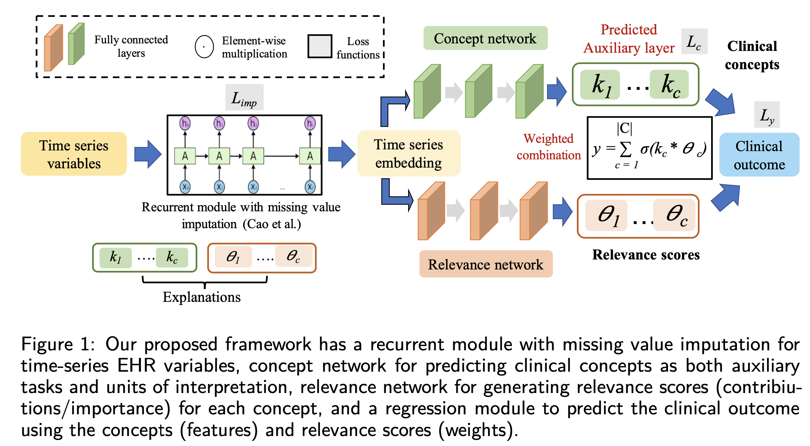
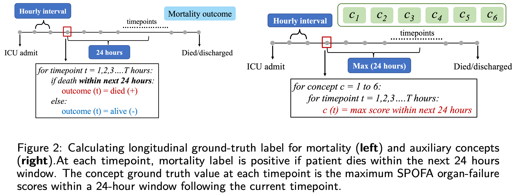
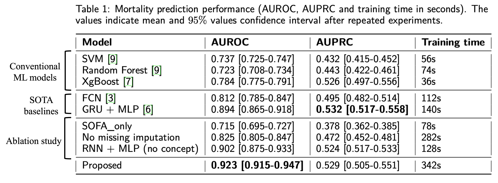
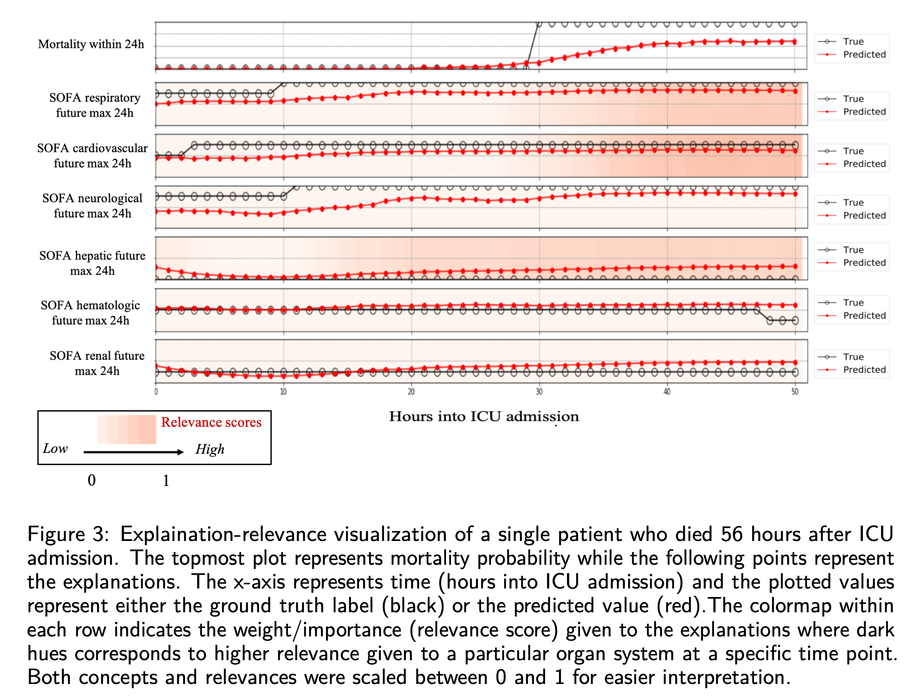

# Overview
This repository contains official implementation for our paper titled "Self-explaining Neural Network with Concept-based
Explanations for ICU Mortality Prediction" [Paper](https://dl.acm.org/doi/pdf/10.1145/3535508.3545547) and our NeurIPS 2023 Workshop paper "Explaining Longitudinal Clinical Outcomes using Domain-Knowledge driven Intermediate Concepts" [Paper](https://openreview.net/forum?id=hpuOA3nkVW)




## Abstract

The black-box nature of complex deep learning models makes it challenging to explain the rationale behind model predictions to clinicians and healthcare providers. Most of the current explanation methods in healthcare provide expla- nations through feature importance scores, which identify clinical features that are important for prediction. For high-dimensional clinical data, using individual input features as units of explanations often leads to noisy explanations that are sensitive to input perturbations and less informative for clinical interpreta- tion. In this work, we design a novel deep learning framework that predicts domain-knowledge driven intermediate high-level clinical concepts from input features and uses them as units of explanation. Our framework is self-explaining; relevance scores are generated for each concept to predict and explain in an end-to-end joint training scheme. We perform systematic experiments on a real-world electronic health records dataset to evaluate both the performance and explainability of the predicted clinical concepts.

## Domain-knowledge concepts and clinical outcome

### Clinical outcome

Our aim is to predict the risk(probability) of a patient’s death at each timestep within his/her stay in the ICU. At each timepoint within the patient’s ICU trajectory, the model predicts if the patient will die within the next 24 hours period (**Figure 2 left**). For example, if a patient stays within the ICU from t=0 to t=56 hours(death time) then the clinical outcome labels (ground truth) from t=0 to t=32 will be 0 (survival) and 1 (death) from t=32 onwards (**Figure 3**).

### Domain-knowledge concepts

Our proposed framework uses [Sequential Organ Failure Assessment (SOFA)](https://en.wikipedia.org/wiki/SOFA_score) organ-failure risk scores as high-level clinical concepts to explain patient mortality in the ICU. The six concepts in our model correspond to the **organ-failure risk scores** for each of the six organ systems: 
- respiratory
- cardiovascular
- neurological
- hepatic
- hematologic (coagulation)
- renal systems.

SOFA organ-specific scores vary between 0-4 with high scores indicating severe organ system conditions. The SOFA organ scores satisfy the properties of clinical concepts since they are:
- **expert-knowledge driven**: well-validated metric used by clinicians to understand ICU mortality
- **intermediate knowledge**: each organ-failure score is an aggregated assessment of clinical features
- **high-level**: easier for human cognition since we are moving one level up from feature-level to organ level.

Similar to the final clinical outcome, the predicted explanations are also anticipated longitudinal predictions. At each timestep, the model predicts anticipated organ-failure risk scores (maximum score within the next 24 hour window) (**Figure 2 right**)



# Implementation details

## Environment
- We recommend an environment with python >= 3.7 and pytorch >= 1.10.2, and then install the following dependencies:
```
pip install -r requirements.txt
```

## Data extraction from MIMIC IV and preprocessing
The **MIMIC_data_extaction.py** script is used to extract the time-series and the time-invariant features from the MIMIC-IV v0.4 dataset. Instructions for downloading data from the MIMIC IV v0.4 dataset can be found [here](https://physionet.org/content/mimiciv/0.4/).  This script also calculates the ground truth labels for concepts (SOFA otrgan-falure-risk scores) and the clinical outcome (ICU mortality). 

For each patient, we extracted 87 time-series features and 24 static features which included laboratory test results, vital signs, comorbidities, admission information and demographics. The MIMIC files used in our study are as follows: 
```
- patients.csv
- admissions.csv
- chartevents.csv
- transfers.csv
- diagnoses_icd.csv
- d_icd_diagnoses.csv
- d_items.csv
- labevents.csv
- inputevents.csv
- outputevents.csv
```
The functions for extracting relevant features from each of the MIMIC files are given in the script **utils_data_extraction.py**. 


## Feature preprocessing
The **data_splitter.py** script is used for splitting the data into train-validation-test (75:15:10), scaling variables and converting dataframes into tensors for input to the model. Feature pre-processing of time-series variables include clipping the outlier values to the 1st and 99th percentile values and standardization using the RobustScalar package from sklearn. 

## Model training and evaluation

All components of our proposed architecture have been implemented in the **model.py** script, including the recurrent module with time-series module, concept and relevance network (**Figure 1**). 

The **train_evaluate.py** script has the complete training module and the evaluation functions for generating model performance (AUROC/AUPRC) (**Table 1**) and model explanations at each timepoint (**Figure 3**). 





## Citation
If you find our work is useful in your research, please consider raising a star  :star:  and citing:

```
@inproceedings{kumar2022self,
  title={Self-explaining neural network with concept-based explanations for ICU mortality prediction},
  author={Kumar, Sayantan and Yu, Sean C and Kannampallil, Thomas and Abrams, Zachary and Michelson, Andrew and Payne, Philip RO},
  booktitle={Proceedings of the 13th ACM International Conference on Bioinformatics, Computational Biology and Health Informatics},
  pages={1--9},
  year={2022}
}

@inproceedings{kumar2023explaining,
  title={Explaining Longitudinal Clinical Outcomes using Domain-Knowledge driven Intermediate Concepts},
  author={Kumar, Sayantan and Kannampallil, Thomas and Sotiras, Aristeidis and Payne, Philip},
  booktitle={XAI in Action: Past, Present, and Future Applications},
  year={2023}
}
```
